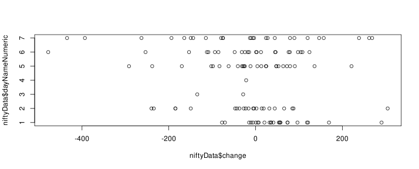

# data-analysis-r
Using R we analyse stock data and report the results.

# Disclaimer:

This is for educational purpose only and does not have any practical consequence.
The result of analysis is meaningless and use it at your own risk. There is no liability or responsibility of the author regarding the analysis, the results and any damage you get from using this project.

# Introduction:

We need to use the historical data, then perform regression analysis to find the relationship between the change of one day with parameters like the open, close, low, high, change of the price of index.

Then we plot the significant results from the analysis.

The result of the analysis is present in html format in the project as [Result In HTML](StockAnalysis.html)

The plot is output by default is in [RPlots.pdf](Rplots.pdf).

## Result:

Coefficients:
|                            | Estimate   | Std. Error | t value    | Pr(>    \| t \| ) |
| -------------------------- | ---------- | ---------- | ---------- | ----------------- |
| (Intercept)                | -1.547e-09 | 5.682e-10  | -2.723e+00 | 0.00750           |
| niftyData$Open             | -1.000e+00 | 1.404e-14  | -7.123e+13 | < 2e-16           |
| niftyData$High             | -1.440e-16 | 1.466e-14  | -1.000e-02 | 0.99218           |
| niftyData$Low              | 2.269e-15  | 1.587e-14  | 1.430e-01  | 0.88657           |
| niftyData$Close            | 1.000e+00  | 1.385e-14  | 7.223e+13  | < 2e-16           |
| niftyData$dateParsed       | 8.207e-14  | 3.017e-14  | 2.720e+00  | 0.00756           |
| niftyData$dayNameMonday    | -4.762e-13 | 2.113e-12  | -2.250e-01 | 0.82210           |
| niftyData$dayNameSaturday  | -1.315e-12 | 5.293e-12  | -2.490e-01 | 0.80418           |
| niftyData$dayNameSunday    | -2.151e-12 | 7.234e-12  | -2.970e-01 | 0.76676           |
| niftyData$dayNameThursday  | -3.359e-12 | 2.055e-12  | -1.634e+00 | 0.10496           |
| niftyData$dayNameTuesday   | -5.809e-13 | 2.133e-12  | -2.720e-01 | 0.78590           |
| niftyData$dayNameWednesday | -5.558e-13 | 2.123e-12  | -2.620e-01 | 0.79400           |

We see there is strong correlation between high of the day, low of the day. This is because if the market open at high value, it will also have close somewhere near but not too low and thus there positive and high value between high and low of the day.

Since market has been giving a rally positively over time, market has overall trend of going upwards during this time, thus there is occurance of postive change in market and highs and lows are also going up, thus the regression model thinks they are correlated.

We see the result of linear analysis says there is strong correlation between Monday and Wednesday as day to the change. Because its p-value is highest.

We see the the values of the day to its numeric values is as given below:

| row# | level     | index |
| ---- | --------- | ----- |
| 1    | Friday    | 1     |
| 2    | Monday    | 2     |
| 3    | Saturday  | 3     |
| 4    | Sunday    | 4     |
| 5    | Thursday  | 5     |
| 6    | Tuesday   | 6     |
| 7    | Wednesday | 7     |

And the plot shows the following:



Thus we conclude that day with numeric value 1 here which is Friday is most of the time positive change. Though in the bull market everybody is winner.

# Tools Used:

## Build using CMD:

```sh
Rscript StockAnalysis.r
```

## Build using GUI:

Use RStudio from Posit, linked [Posit](https://posit.co/).